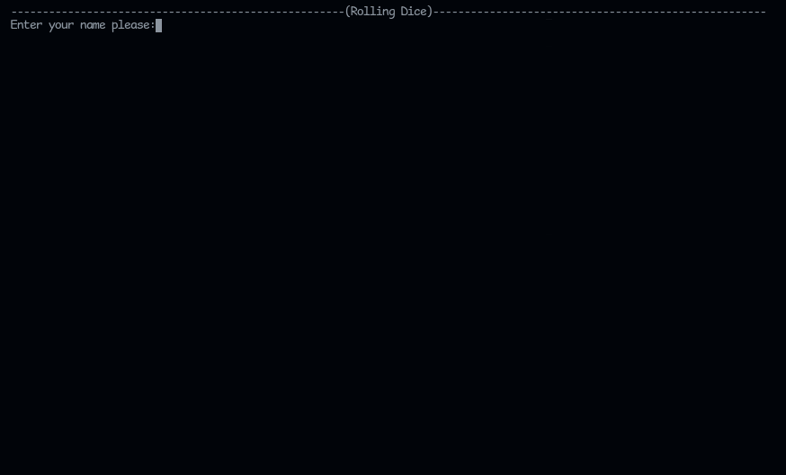

# Rolling Dice Game

Rolling dice game in terminal build with  and .

## Demo

### Note
the previous screenshot was taken from **Linux machine**, and 
the game appearance may be different depending on your **Operating-System**.

for **Windows machines** the game will not work and that because i use,
some special [Uni-code characters](https://en.wikipedia.org/wiki/Box-drawing_character) to draw the Dices.

### To-Do

- [ ] Make the game work for Windows machines.
- [ ] Add some Colors.

